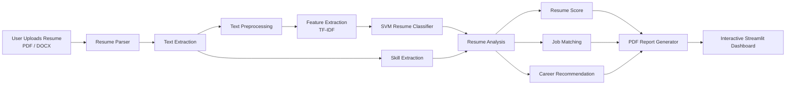
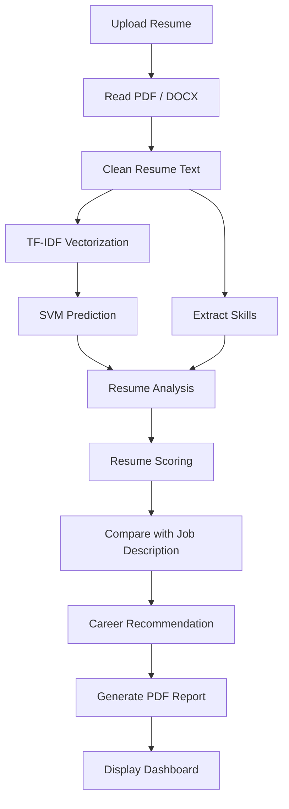

# 🤖 AI Resume Screening and Job Matching System

<div align="center">


[](https://ai-resume-screening-and-job-matching.streamlit.app/)

</div>

---

## 📌 Project Overview

The **AI Resume Screening and Job Matching System** is an intelligent machine learning application that automates the resume evaluation process. It analyses resumes, predicts professional domains, extracts technical skills, evaluates resume quality, compares resumes with job descriptions, and generates professional PDF reports—all through an interactive Streamlit web application.

The project combines **Machine Learning**, **Natural Language Processing (NLP)**, and **Data Analysis** to reduce manual resume screening effort while providing actionable insights for candidates and recruiters.

---

## ✨ Key Highlights

- 📄 Supports **PDF** and **DOCX** resumes
- 🤖 Resume Classification using **Support Vector Machine (SVM)**
- 🧹 Automated resume preprocessing pipeline
- 🧠 Technical skill extraction
- 📊 Resume quality analysis and scoring
- 💼 Job Description matching with similarity scoring
- 🎯 Career recommendations based on resume profile
- 📑 Professional PDF report generation
- 📈 Interactive Streamlit dashboard
- ⚡ Modular and scalable project architecture

---

# 📑 Table of Contents

- [📌 Project Overview](#-project-overview)
- [✨ Key Highlights](#-key-highlights)
- [🏗️ System Architecture](#️-system-architecture)
- [⚙️ Complete Workflow](#️-complete-workflow)
- [📂 Project Structure](#-project-structure)
- [🛠️ Technology Stack](#️-technology-stack)
- [🧠 Machine Learning Pipeline](#-machine-learning-pipeline)
- [📊 Model Performance](#-model-performance)
- [🔍 Resume Classification](#-resume-classification)
- [💡 Skill Extraction](#-skill-extraction)
- [📋 Resume Analysis](#-resume-analysis)
- [⭐ Resume Scoring](#-resume-scoring)
- [🎯 Job Matching Engine](#-job-matching-engine)
- [🚀 Career Recommendation Engine](#-career-recommendation-engine)
- [📄 PDF Report Generation](#-pdf-report-generation)
- [💻 Installation Guide](#-installation-guide)
- [▶️ Usage](#️-usage)
- [📜 Future Enhancements](#-future-enhancements)
- [🤝 Contributing](#-contributing)
- [📄 License](#-license)
- [🙏 Acknowledgements](#-acknowledgements)

---

# 🏗️ System Architecture



---

# ⚙️ Complete Workflow



---

# 📂 Project Structure

```text
AI-Resume-Screening-and-Job-Matching-System
│
├── app/
│   └── app.py
│
├── assets/
│   ├── banner/
│   ├── logo.png
│   └── screenshots/
│
├── data/
│   ├── raw/
│   │   ├── Resume.csv
│   │   └── job_descriptions/
│   │
│   ├── interim/
│   ├── processed/
│   └── sample_resumes/
│
├── docs/
│
├── models/
│   ├── trained_models/
│   │   └── svm_model.pkl
│   │
│   ├── vectorizers/
│   │   └── tfidf_vectorizer.pkl
│   │
│   ├── encoders/
│   │   └── label_encoder.pkl
│   │
│   └── embeddings/
│
├── notebooks/
│
├── src/
│   ├── analysis/
│   ├── extraction/
│   ├── matching/
│   ├── models/
│   ├── parser/
│   ├── preprocessing/
│   ├── recommendation/
│   ├── reports/
│   ├── scoring/
│   ├── services/
│   └── predict.py
│
├── LICENSE
├── README.md
├── requirements.txt
└── .gitignore
```

---

# 🛠️ Technology Stack

This project integrates Machine Learning, Natural Language Processing (NLP), Data Analysis, and Web Application Development into a modular AI-powered resume screening platform.

---

## 👨‍💻 Programming Language

| Technology | Purpose |
|------------|---------|
| Python 3.13 | Core application development |

---

## 🌐 Web Framework

| Technology | Purpose |
|------------|---------|
| Streamlit | Interactive web application and dashboard |

---

## 🤖 Machine Learning

| Library | Purpose |
|----------|---------|
| Scikit-learn | Resume classification using Support Vector Machine |
| Joblib | Saving and loading trained ML models |

---

## 🧠 Natural Language Processing (NLP)

| Library | Purpose |
|----------|---------|
| NLTK | Tokenization, stopword removal and lemmatization |

---

## 📊 Data Analysis

| Library | Purpose |
|----------|---------|
| Pandas | Dataset loading and manipulation |
| NumPy | Numerical operations |

---

## 📈 Data Visualization

| Library | Purpose |
|----------|---------|
| Plotly | Interactive charts |
| Matplotlib | Statistical visualizations |
| Seaborn | Exploratory data analysis |

---

## 📄 Document Processing

| Library | Purpose |
|----------|---------|
| pdfplumber | PDF text extraction |
| pdfminer.six | Advanced PDF parsing |
| python-docx | DOCX resume parsing |

---

## 📑 Report Generation

| Library | Purpose |
|----------|---------|
| ReportLab | Professional PDF report generation |

---

## 💾 Model Persistence

| Library | Purpose |
|----------|---------|
| Joblib | Stores trained SVM model, TF-IDF vectorizer and Label Encoder |

---

## 🔧 Development Tools

| Tool | Purpose |
|------|---------|
| Jupyter Notebook | Data exploration and model training |
| Git | Version control |
| GitHub | Repository hosting |
| VS Code | Development environment |
| Anaconda | Python environment management |

---

## 📦 Project Dependencies

- Python 3.13
- Streamlit
- Scikit-learn
- Pandas
- NumPy
- NLTK
- Plotly
- Matplotlib
- Seaborn
- pdfplumber
- pdfminer.six
- python-docx
- ReportLab
- Joblib

---

# 🧠 Machine Learning Pipeline

The machine learning pipeline is designed to automatically classify resumes into their corresponding professional domains. The pipeline consists of multiple stages, beginning with raw resume data and ending with accurate predictions using a trained Support Vector Machine (SVM) classifier.

## Pipeline Overview

```text
Resume Dataset
      │
      ▼
Text Cleaning
      │
      ▼
Tokenization
      │
      ▼
Stopword Removal
      │
      ▼
Lemmatization
      │
      ▼
TF-IDF Feature Extraction
      │
      ▼
Train-Test Split
      │
      ▼
Support Vector Machine (SVM)
      │
      ▼
Model Evaluation
      │
      ▼
Save Trained Model
      │
      ▼
Resume Prediction
```

---

## Step 1 — Dataset Collection

The project uses a publicly available Resume Dataset containing resumes from multiple professional domains.

Examples of categories include:

- Information Technology
- Data Science
- HR
- Finance
- Sales
- Healthcare
- Engineering
- Advocate
- Banking
- Business Development
- Aviation
- Consultant
- Construction
- Fitness
- Chef
- Accountant
- and many more.

The dataset is stored as:

```text
data/raw/Resume.csv
```

---

## Step 2 — Data Cleaning

The raw resume text undergoes several preprocessing operations to improve model performance.

These include:

- Convert text to lowercase
- Remove punctuation
- Remove special characters
- Remove numbers where appropriate
- Remove extra spaces
- Normalize text

This ensures consistency across all resumes.

---

## Step 3 — Tokenization

Each resume is divided into individual words (tokens).

Example:

Before

```
Experienced Python Developer with Machine Learning skills
```

After

```
["experienced",
 "python",
 "developer",
 "machine",
 "learning",
 "skills"]
```

---

## Step 4 — Stopword Removal

Common English words that carry little semantic meaning are removed.

Examples:

- the
- is
- and
- of
- for
- with

This allows the model to focus on informative words.

---

## Step 5 — Lemmatization

Words are converted to their root form.

Examples

| Original | Lemmatized |
|-----------|------------|
| Running | Run |
| Developed | Develop |
| Engineers | Engineer |
| Skills | Skill |

This reduces vocabulary size and improves generalization.

---

## Step 6 — Feature Extraction

Machine learning models cannot process raw text directly.

Therefore, resumes are transformed into numerical vectors using:

**TF-IDF (Term Frequency–Inverse Document Frequency)**

The vectorizer learns the importance of words across all resumes and converts each resume into a high-dimensional numerical representation.

Saved vectorizer:

```text
models/vectorizers/tfidf_vectorizer.pkl
```

---

## Step 7 — Train-Test Split

The processed dataset is divided into:

- Training Data
- Testing Data

The training set is used to train the classifier, while the testing set evaluates model performance on unseen resumes.

---

## Step 8 — Model Training

The project uses a **Support Vector Machine (SVM)** classifier.

Why SVM?

- Effective for text classification
- Performs well on high-dimensional TF-IDF vectors
- Robust against overfitting
- Strong generalization capability
- Widely used for NLP classification tasks

Saved model:

```text
models/trained_models/svm_model.pkl
```

---

## Step 9 — Label Encoding

Professional categories are converted into numerical labels before model training.

Example:

| Category | Encoded |
|----------|----------|
| HR | 0 |
| Finance | 1 |
| IT | 2 |

Saved encoder:

```text
models/encoders/label_encoder.pkl
```

---

## Step 10 — Prediction Pipeline

When a user uploads a resume:

1. Resume is parsed
2. Text is extracted
3. Text is cleaned
4. TF-IDF vector is generated
5. SVM predicts the category
6. Category label is decoded
7. Prediction is displayed on the dashboard

This entire pipeline executes automatically in a few seconds.

---

# 📊 Model Performance

The machine learning model was evaluated using a hold-out test dataset to measure its ability to classify unseen resumes.

## Evaluation Strategy

The dataset was divided into:

| Dataset | Purpose |
|----------|---------|
| Training Set | Train the Support Vector Machine classifier |
| Testing Set | Evaluate prediction performance on unseen resumes |

---

## Model

| Parameter | Value |
|-----------|-------|
| Algorithm | Support Vector Machine (SVM) |
| Feature Extraction | TF-IDF Vectorizer |
| Target Variable | Resume Category |
| Multi-Class Classification | Yes |

---

## Evaluation Metrics

The model was evaluated using the following metrics:

- Accuracy
- Precision
- Recall
- F1-Score
- Classification Report

These metrics provide a balanced evaluation of classification performance across multiple resume categories.

---

## Model Strengths

✅ High-dimensional text classification

✅ Fast prediction speed

✅ Good generalization capability

✅ Effective on sparse TF-IDF vectors

✅ Robust performance for resume classification

---

## Current Limitations

Like most text classification systems, the model has certain limitations:

- Prediction quality depends on resume content.
- Resumes with very limited information may reduce accuracy.
- Generic resumes can overlap across multiple professional domains.
- Prediction performance depends on dataset quality and diversity.

---

## Future Improvements

Possible enhancements include:

- Hyperparameter optimization
- Cross-validation
- Larger and more diverse datasets
- Transformer-based NLP models (e.g., BERT)
- Sentence embeddings
- Semantic similarity techniques
- Deep Learning architectures

---

## Why Support Vector Machine?

Support Vector Machine was selected because it performs exceptionally well for text classification tasks.

Advantages include:

- Excellent performance on sparse data
- Effective with high-dimensional feature spaces
- Strong mathematical foundation
- Reliable generalization
- Widely adopted in Natural Language Processing applications

---

# 🔍 Resume Classification

The Resume Classification module automatically predicts the professional domain of an uploaded resume using a trained **Support Vector Machine (SVM)** model.

## Classification Workflow

```text
Resume Upload
      │
      ▼
Extract Text
      │
      ▼
Clean & Preprocess
      │
      ▼
TF-IDF Vectorization
      │
      ▼
SVM Prediction
      │
      ▼
Predicted Resume Category
```

### Supported Categories

The classifier can identify resumes belonging to multiple professional domains, including:

- Information Technology
- Data Science
- Engineering
- Finance
- Human Resources
- Sales
- Banking
- Healthcare
- Business Development
- Advocate
- Consultant
- Construction
- Aviation
- Fitness
- Chef
- Accountant
- And many more.

The predicted category is displayed instantly within the Streamlit dashboard after the resume is processed.

---

# 📋 Resume Analysis

The Resume Analysis module evaluates the overall quality and completeness of a resume.

The analysis includes multiple aspects such as:

- Resume length
- Skills identified
- Resume category
- Content completeness
- Technical information
- Professional profile strength

The purpose of this module is to provide meaningful insights before generating a resume score.

---

# ⭐ Resume Scoring

The application evaluates resumes using a weighted scoring methodology.

Instead of relying on a single metric, multiple resume characteristics contribute to the final score.

## Evaluation Factors

- Skills detected
- Resume completeness
- Technical content
- Professional keywords
- Overall resume quality

The calculated score provides users with an estimate of how well their resume aligns with industry expectations.

The score is displayed visually within the dashboard and is also included in the generated PDF report.

---

# 🎯 Job Matching Engine

One of the key features of this project is the Job Matching Engine.

Users can provide a job description along with their resume.

The application compares both documents and estimates how well the candidate matches the job requirements.

## Workflow

```text
Resume
      │
      ├──────────────┐
      ▼              │
Extract Skills       │
                     │
Job Description      │
      │              │
      ▼              │
Extract Keywords     │
      │              │
      ▼              │
Compare Skills ◄─────┘
      │
      ▼
Matching Score
```

The matching score helps candidates understand how closely their resume aligns with a particular job role.

---

# 🚀 Career Recommendation Engine

Based on the predicted category, extracted skills and resume analysis, the application provides career recommendations.

Recommendations may include:

- Suitable job roles
- Career domains
- Areas for improvement
- Suggested skills to learn
- Resume enhancement suggestions

This feature helps users understand possible career paths and improve their employability.

---

# 📄 PDF Report Generation

The application generates professional PDF reports summarising the complete resume analysis.

Two report formats are available:

## Quick Report

Contains:

- Resume category
- Resume score
- Extracted skills
- Job match percentage
- Career recommendation

## Detailed Report

Contains:

- Resume analysis
- Resume score breakdown
- Skill analysis
- Job matching details
- Career recommendations
- Improvement suggestions

Reports are generated dynamically using **ReportLab** and can be downloaded directly from the Streamlit application without storing uploaded resumes or generated reports on disk.

---

# 💻 Installation Guide

If you only want to use the application, you can access the live deployment using the link above. Local installation is only required if you want to run or modify the project yourself.

Follow the steps below to set up the project on your local machine.

## 1. Clone the Repository

```bash
git clone https://github.com/4kayasitayashu/AI-Resume-Screening-and-Job-Matching-System.git
```

---

## 2. Navigate to the Project Directory

```bash
cd AI-Resume-Screening-and-Job-Matching-System
```

---

## 3. Create a Virtual Environment (Recommended)

### Windows

```bash
python -m venv venv
venv\Scripts\activate
```

### Linux / macOS

```bash
python3 -m venv venv
source venv/bin/activate
```

---

## 4. Install Dependencies

```bash
pip install -r requirements.txt
```

---

## 5. Run the Application

```bash
streamlit run app/app.py
```

---

## 6. Open the Browser

The application will automatically open in your default browser.

If it does not open automatically, visit:

```
http://localhost:8501
```

---

# ▶️ Usage

Using the application is straightforward.

## Step 1

Launch the Streamlit application.

---

## Step 2

Upload a resume in either:

- PDF
- DOCX

format.

---

## Step 3

(Optional) Provide a job description for matching.

---

## Step 4

Click the **Analyze Resume** button.

---

## Step 5

The application performs:

- Resume Parsing
- Text Preprocessing
- Resume Classification
- Skill Extraction
- Resume Analysis
- Resume Scoring
- Job Matching
- Career Recommendation

---

## Step 6

View the generated insights directly on the dashboard.

---

## Step 7

Download the generated PDF report.


---

# 📜 Future Enhancements

Future improvements planned for this project include:

- Resume ranking for multiple candidates
- Multiple machine learning model comparison
- Deep Learning based resume classification
- Transformer models (BERT, RoBERTa)
- OCR support for scanned resumes
- AI-powered resume improvement suggestions
- Recruiter dashboard
- Authentication system
- Database integration
- Cloud deployment
- REST API support
- Docker containerization
- CI/CD pipeline
- Multilingual resume support
- Real-time analytics dashboard


---

# 🤝 Contributing

Contributions are welcome.

If you would like to improve this project:

1. Fork the repository.
2. Create a new feature branch.
3. Commit your changes.
4. Push your branch.
5. Open a Pull Request.

Please ensure that your code follows good development practices and includes appropriate documentation where necessary.


---

# 📄 License

This project is licensed under the MIT License.

See the [LICENSE](LICENSE) file for complete details.


⭐ If you found this project useful, consider giving it a star on GitHub.

---

# 🙏 Acknowledgements

This project was developed as part of a comprehensive Machine Learning and Natural Language Processing learning journey.

Special thanks to the open-source community and the developers of:

- Streamlit
- Scikit-learn
- Pandas
- NumPy
- NLTK
- Plotly
- ReportLab
- pdfplumber
- python-docx

whose libraries made this project possible.

